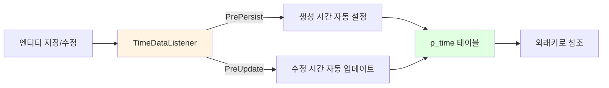
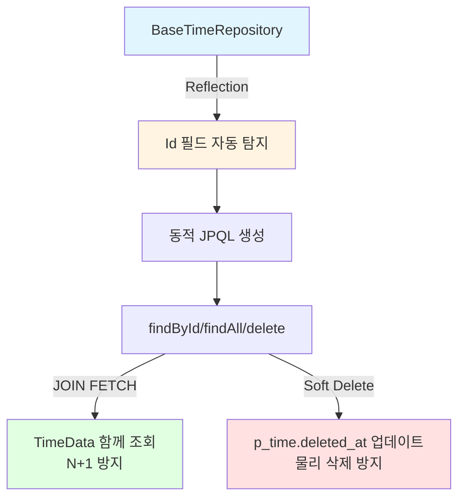
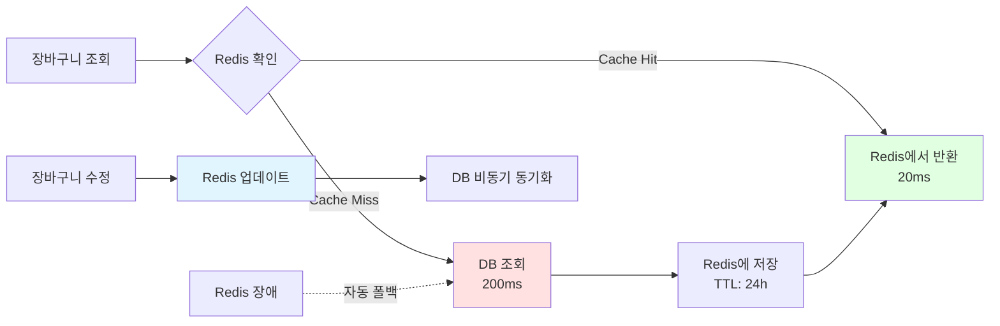

# 🍽 Eat Cloud Project

Goorm 프로펙트 클라우드 엔지니어링 과정 3기 – 1차 프로젝트  

## 📌 프로젝트 소개
**Eat Cloud**는 '배달의 민족'을 벤치마킹한 **주문 관리 플랫폼**입니다.  
기존 오프라인 음식 주문 과정을 온라인으로 전환하여 주문·결제·배달 관리의 자동화를 목표로 **모놀리식 애플리케이션**을 개발했습니다.

## 📆 개발 기간
- 25.07.21 ~ 25.08.06

## 👥 멤버 구성
- 오해인
- [강능요](https://github.com/teadmu)  
- [정연주](https://github.com/racoi)  
- [정민영](https://github.com/minmaker-komu)  
- 홍성문

## 🛠 기술 스택
`Java` `Spring Boot` `Spring Security` `PostgreSQL` `PostGIS` `Redis` `QueryDSL`

## ✨ 주요 기능
- **Spring Security + JWT 기반 사용자 인증/인가**, 회원가입 시 이메일 인증 기능
- 거리 기반 매장/메뉴 카테고리 별 매장 조회
- AI 기반 메뉴 설명 자동 생성 기능
- 토스 API 연동 결제 시스템
- **[JPA Entity Listener를 활용한 생성, 수정 시간 자동 관리](#1-jpa-entity-listener-자동화)**
- **[Reflection 기반 범용 Repository 개발](#2-범용-repository-개발)**
- **[Redis Cache-Aside 패턴으로 장바구니 성능 최적화](#3-redis-cache-aside-패턴-적용)**
- 공통 응답 구조 및 예외 처리

## 🏗 디렉토리 구조
```
profect-eatcloud/
  src/
    main/
      java/
        profect/
          eatcloud/
            common/                  - 공통 응답/예외/유틸
            config/                  - 전역 설정(Async, QueryDSL, Redis 등)
            domain/                  
              admin/                 - 관리자/카테고리/매장 관리
              customer/              - 고객/주소/장바구니/주문 요청
              globalCategory/        - 공통 카테고리·주문상태 코드
              manager/               - 점주(매니저) 계정 및 매장 신청
              order/                 - 주문/픽업·배달/리뷰
              payment/               - 결제/결제요청/콜백 처리
              store/                 - 매장/메뉴/매출/AI 설명
            global/                  - 공용 인프라(queryDSL, timeData)
            login/                   - 로그인/인증
            security/                - Spring Security/JWT/필터
            EatcloudApplication.java - 애플리케이션 진입점
```

---

## 1. JPA Entity Listener 자동화

### 문제 정의
배달 앱의 15개 테이블에 각각 4개의 시간 관련 컬럼(생성시간, 생성자, 수정시간, 수정자)이 중복으로 존재했습니다.
- **60개의 중복 컬럼**: 15개 테이블 × 4개 컬럼
- **주 23건의 휴먼 에러**: 개발자가 수동으로 시간/사용자 정보를 설정하면서 발생
- **유지보수 복잡성**: 정책 변경 시 15개 테이블 모두 수정 필요

### 아키텍처



### 해결 방안

#### 1) UUID 기반 중앙 시간 관리 테이블 설계
```sql
CREATE TABLE p_time (
    p_time_id  UUID PRIMARY KEY,
    created_at TIMESTAMP NOT NULL,
    created_by VARCHAR(100) NOT NULL,
    updated_at TIMESTAMP NOT NULL,
    updated_by VARCHAR(100) NOT NULL,
    deleted_at TIMESTAMP,
    deleted_by VARCHAR(100)
);
```

**기존 방식 vs 개선된 방식**:
```sql
-- 기존: 모든 테이블마다 중복 (15개 테이블 × 4개 = 60개 컬럼)
CREATE TABLE customers (
    id UUID PRIMARY KEY,
    name VARCHAR(20),
    created_at TIMESTAMP,
    created_by VARCHAR(100),
    updated_at TIMESTAMP,
    updated_by VARCHAR(100)
);

-- 개선: 단일 외래키로 관리 (15개 테이블 × 1개 = 15개 컬럼)
CREATE TABLE p_customer (
    id UUID PRIMARY KEY,
    name VARCHAR(20),
    p_time_id UUID NOT NULL,
    CONSTRAINT fk_p_users_p_time FOREIGN KEY (p_time_id) REFERENCES p_time (p_time_id)
);
```

#### 2) BaseTimeEntity 추상 클래스
```java
@MappedSuperclass
@EntityListeners(TimeDataListener.class)
public abstract class BaseTimeEntity {
    @ManyToOne(fetch = FetchType.LAZY, cascade = {CascadeType.PERSIST, CascadeType.MERGE})
    @JoinColumn(name = "p_time_id", nullable = false)
    private TimeData timeData;
}
```

#### 3) JPA Entity Listener를 통한 완전 자동화
```java
public class TimeDataListener {

    @PrePersist
    public void prePersist(BaseTimeEntity entity) {
        if (entity.getTimeData() == null) {
            String user = SecurityUtil.getCurrentUsername();
            LocalDateTime now = LocalDateTime.now();

            TimeData td = TimeData.builder()
                .pTimeId(UUID.randomUUID())
                .createdAt(now)
                .createdBy(user)
                .updatedAt(now)
                .updatedBy(user)
                .build();

            entity.setTimeData(td);
        }
    }

    @PreUpdate
    public void preUpdate(BaseTimeEntity entity) {
        if (entity.getTimeData() != null) {
            String user = SecurityUtil.getCurrentUsername();
            LocalDateTime now = LocalDateTime.now();

            entity.getTimeData().setUpdatedAt(now);
            entity.getTimeData().setUpdatedBy(user);
        }
    }
}
```

#### 4) 개발자 코드 (완전 자동화)
```java
@Service
public class CustomerService {
    public Customer createCustomer(CustomerRequest request) {
        Customer customer = Customer.builder()
            .name(request.getName())
            .email(request.getEmail())
            .build();
        
        // 생성시간, 생성자, 수정시간, 수정자 모두 자동 설정!
        return customerRepository.save(customer);
    }
}
```

### 성과
- ✅ **휴먼 에러 제거**
- ✅ **코드 중복**: 60개 → 6개 컬럼 (90% 감소)
- ✅ **엔티티 개발 시간**
- ✅ **완전 감사 추적**: 누가(who), 언제(when), 무엇을(what) 자동 기록

---

## 2. 범용 Repository 개발

### 문제 정의
각 엔티티마다 ID 필드명이 달라서 범용 Repository 구현이 불가능했습니다.

```java
public class Customer {
    @Id
    private UUID id;  // customerId가 아닌 id
}

public class Store {
    @Id
    private UUID storeId;  // id가 아닌 storeId
}
```

### 아키텍처



### 해결 방안

#### 1) Reflection으로 @Id 필드 자동 탐지
```java
public class BaseTimeRepositoryImpl<T extends BaseTimeEntity, ID> 
    extends SimpleJpaRepository<T, ID> 
    implements BaseTimeRepository<T, ID> {

    private final String idFieldName;
    private final String entityName;

    // Reflection으로 @Id 애노테이션이 붙은 필드 자동 탐지
    private String findIdFieldName(Class<?> entityClass) {
        Field[] fields = entityClass.getDeclaredFields();
        for (Field field : fields) {
            if (field.isAnnotationPresent(Id.class)) {
                return field.getName();
            }
        }
        throw new RuntimeException("@Id 필드를 찾을 수 없습니다");
    }
}
```

#### 2) 동적 JPQL 생성
```java
@Override
public Optional<T> findById(ID id) {
    // 필드명에 상관없이 동적으로 JPQL 생성
    String jpql = String.format(
        "SELECT e FROM %s e JOIN FETCH e.timeData t WHERE e.%s = :id AND t.deletedAt IS NULL",
        entityName, idFieldName  // 동적으로 결정
    );
    
    TypedQuery<T> query = entityManager.createQuery(jpql, getDomainClass());
    query.setParameter("id", id);
    return query.getResultList().stream().findFirst();
}
```

#### 3) JOIN FETCH로 N+1 문제 방지
```java
@Override
public List<T> findAll() {
    String jpql = String.format(
        "SELECT e FROM %s e JOIN FETCH e.timeData t WHERE t.deletedAt IS NULL",
        entityName
    );
    
    TypedQuery<T> query = entityManager.createQuery(jpql, getDomainClass());
    return query.getResultList();
}
```

#### 4) Soft Delete 자동 구현
```java
@Override
@Transactional
public void softDeleteByTimeId(UUID timeId, LocalDateTime deletedAt, String deletedBy) {
    // Native Query로 p_time 테이블의 deleted_at만 설정
    String sql = "UPDATE p_time SET deleted_at = ?, deleted_by = ? WHERE p_time_id = ?";
    
    entityManager.createNativeQuery(sql)
        .setParameter(1, deletedAt)
        .setParameter(2, deletedBy)
        .setParameter(3, timeId)
        .executeUpdate();
}
```

#### 5) 사용법
```java
// 모든 Repository가 BaseTimeRepository를 상속받기만 하면 됨
@Repository
public interface CustomerRepository extends BaseTimeRepository<Customer, UUID> {
}

@Service
public class CustomerService {
    public void deleteCustomer(UUID id) {
        customerRepository.deleteById(id);  // 자동으로 소프트 삭제!
    }
}
```

### 성과
- ✅ **Repository 개발 시간**
- ✅ **N+1 문제 완전 방지** (JOIN FETCH 자동 적용)
- ✅ **데이터 안전성**: 물리 삭제 방지 + 즉시 복구 가능
- ✅ **완전 감사 추적**: 누가, 언제, 무엇을 삭제했는지 자동 기록

---

## 3. Redis Cache-Aside 패턴 적용

### 문제 정의
장바구니 조회 시 매번 DB를 거쳐 응답 시간이 200ms로 느렸습니다.

### 아키텍처



### 해결 방안

#### 1) Cache-Aside 패턴 구현
```java
@Service
public class CartService {
    private final RedisTemplate<String, Object> redisTemplate;
    private final CartRepository cartRepository;
    private static final Duration CART_TTL = Duration.ofHours(24);

    public List<CartItem> getCart(UUID customerId) {
        // 1. Redis에서 먼저 조회 (Cache Hit)
        List<CartItem> cartItems = getCartFromRedis(customerId);
        
        if (!cartItems.isEmpty()) {
            return cartItems;  // 20ms
        }
        
        // 2. Cache Miss 시 DB 조회
        cartItems = getCartFromDatabase(customerId);  // 200ms
        
        // 3. DB 데이터를 Redis에 저장
        if (!cartItems.isEmpty()) {
            saveCartToRedis(customerId, cartItems);
        }
        
        return cartItems;
    }

    public void addItem(UUID customerId, AddCartItemRequest request) {
        List<CartItem> cartItems = getCart(customerId);
        
        // 아이템 추가 로직
        cartItems.add(CartItem.builder()
            .menuId(request.getMenuId())
            .quantity(request.getQuantity())
            .build());
        
        // Redis 업데이트
        saveCartToRedis(customerId, cartItems);
        
        // DB 비동기 동기화
        syncToDatabaseAsync(customerId, cartItems);
    }
}
```

#### 2) Redis 장애 대응
```java
private List<CartItem> getCartFromRedis(UUID customerId) {
    try {
        if (!isRedisAvailable()) {
            return new ArrayList<>();
        }
        
        String cartKey = getCartKey(customerId);
        Object cartData = redisTemplate.opsForValue().get(cartKey);
        
        return convertToCartItems(cartData);
        
    } catch (RedisConnectionFailureException e) {
        log.warn("Redis unavailable, falling back to database");
        return new ArrayList<>();  // DB로 자동 폴백
    }
}
```

### 성과
- ✅ **응답 시간 개선**: 200ms → 20ms (90% 개선)
- ✅ **DB 부하 감소**: 90% 감소
- ✅ **Redis 장애 대응**: 자동 DB 폴백으로 서비스 중단 없음
- ✅ **데이터 일관성**: 비동기 DB 동기화로 데이터 정합성 보장
